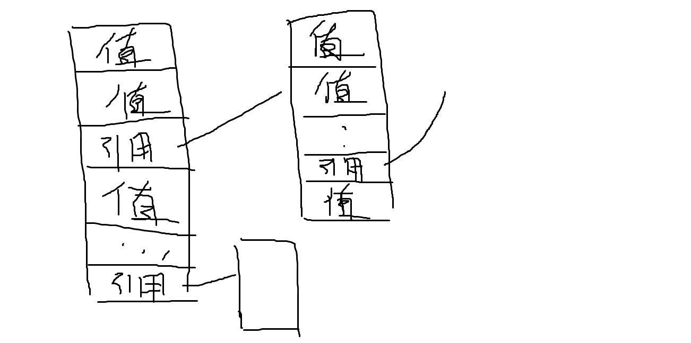
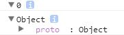

根据访问方式，在ES中可以将数据分为两种类型，值类型和引用类型。

值类型的数据可以被直接访问，而引用类型的数据只能被间接访问。

当我们在谈值和对象的时候是在谈些什么呢？
一言概之，如写程序是工作的具体实例，值就是值类型的具体实例，对象就是引用类型的具体实例。

以下是典型的0值和空对象。

~~~
console.dir(0);
console.dir({});
~~~

在ES中，凡是对象都有其原型，在数据上的表示就是\_\_proto\_\_引用。
关于原型的概念将在后续章节讲解。

# 值和对象在使用上的区别

* 值是不可变的。
* 对象是值的组合，组合是可变的。

~~~
var foo=1;
foo=10;//不是值1变成了值10,而是foo选择的值变成了值10。

var obj={foo:1};
obj.foo=10;//对象的组合从{foo:1}变成{foo:10};
~~~

**为什么要玩这种文字游戏？**
因为如此能让我们专注于一个简单的模型，而无视程序内部繁琐的操作。

~~~
var str='hello'
str[0]='x';
console.info(str);//hello
~~~

在ES，String类型属于值类型，所以字符串不能被改变，所以他的“修改”方法总是返回一个新的字符串。
如concat，replace，slice……

