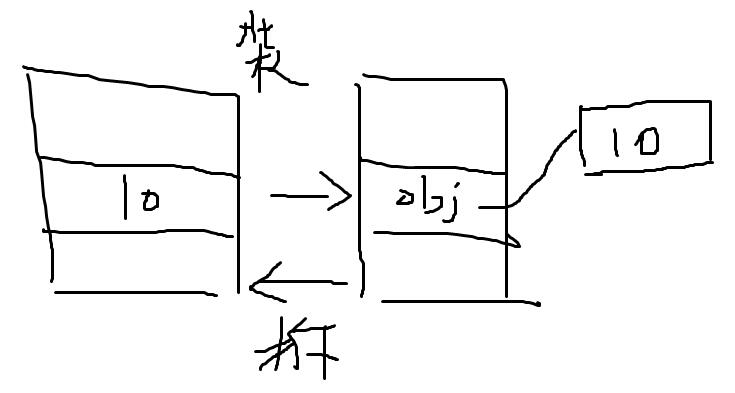
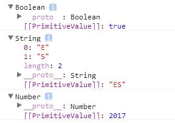

* 装箱指的是，将一个值变成指向该值的对象。（复制值）
* 拆箱指的是，把指向值的对象还原成该值。（复制值）

# 装箱
在ES中，装箱会根据值的原始类型构造不同类的对象。

~~~
var bool = new Object(true);
console.dir(bool);
var str = new Object("ES");
console.dir(str);
var num = new Object(2017);
console.dir(num);
~~~

console.dir的时候，会发现有个\[\[PrimitiveValue\]\]标记，他会显示该对象内部指向的原始值。

# 拆箱

可以通过valueOf函数进行拆箱操作。

~~~
boolPV = bool.valueOf();
console.dir(boolPV);
strPV = str.valueOf();
console.dir(strPV);
numPV = num.valueOf();
console.dir(numPV);
~~~

# 自动装箱

当把一个原始值当作对象使用函数时，ES会触发自动装箱。

~~~
var foo = 100;
foo.toExponential(); "1e+2"
~~~

以下是当执行foo.toExponential()时ES程序内部做的事情：

* 对foo进行装箱，构造出一个新的Number类对象。
* 用该对象调用toExponential函数。
* 返回函数操作结果后，将该对象丢弃。

所以值类型还是值类型，引用类型还是引用类型，他们之间存在着巨大的差异。
不能以“一切都是对象”一言蔽之。
