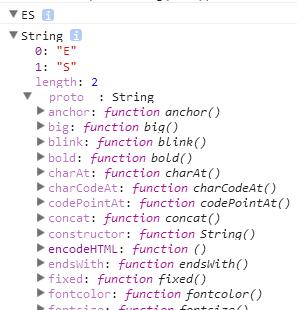

预定义对象，就是指在ES中内置的一些对象，他们集成了ES编程中常用的功能。

有的对象可以作为类(class)，通过与new关键字作用，生成新的对象。
如：

~~~
var obj = new Object();//var obj={}
var arr = new Array();//var arr=[]
~~~

# 类型与类

这里的类型指的是原始值的类型，这里的类，在ES中指的是能通过new来生成对象的对象。

总之，类型跟类是不一样的东西。

ES还内置了几个与原始类型一样名字的对象。

* Boolean
* String
* Number

然而他们的实例是对象，不是值。

~~~
new Boolean(true) == true;//true
new Boolean(true) === true;//false

new String("ES") == "ES";//true
new String("ES") === "ES";//false

new Number(2017) == 2017;//true
new Number(2017) === 2017;//false
~~~

String类构造出的对象，有着很丰富的操作函数。

~~~
console.dir("ES");
console.dir(new String("ES"));
~~~

