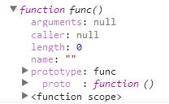
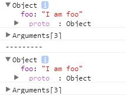
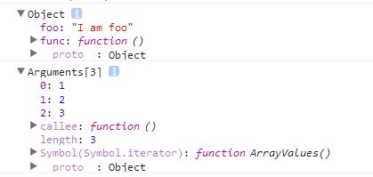

# arguments

函数在运行时，会在函数体内定义一个arguments变量，其内容是调用该函数时传入的参数。

~~~
var func = function () {
    console.dir(arguments);
};

func();//[]
func(10);//[10]
func(10, "ES", true);//[10,"ES",true]
~~~

# call和apply

ES中的函数是以对象的形式存在的。

~~~
var func = function () { };
console.dir(func);
~~~

Function类对象有两个常用的成员函数，call和apply，用于“显式”调用函数。
他们行为是一样的，但是在使用上存在着差别。

~~~
var func = function () {
    console.dir(this);
    console.dir(arguments);
};
var foo = { foo: 'I am foo' };

//call(thisRef,...[argus]);
func.call(foo, 1, 2, 3);
console.log('---------');
//apply(thisRef,[argus])
func.apply(foo, [1, 2, 3]);
~~~

与一般情况下使用函数时的“隐式”调用结果一样。

~~~
foo.func = func;
foo.func(1, 2, 3);
~~~

因此，可以把函数的调用看作是call或apply函数的使用，那么this的绑定行为就不会显得很特别。

# this与装箱

~~~
var func = function () {
    console.dir(this);
};

func.call(2017);//Number类对象

Number.prototype.func = func;
var num = 2017;
num.func();//Number类对象
~~~

