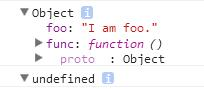

当ES程序通过访问对象的属性来调用(call)一个函数时，该函数体内的this关键字将绑定该对象的引用。
如果直接调用函数本身，this关键字内容为undefined。

~~~
var func = function () {
    console.dir(this);
};

var foo = { foo: "I am foo.", func: func };
foo.func();
func();
~~~

可以知道，this关键字的作用是获取调用函数的对象。