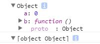

除了使用函数，使用with关键字也可以产生环境。

with(obj)可以产生一个特殊的环境，在该环境中使用约束，如同obj访问自身的属性。

~~~
var obj = {
    func: function () {
        return this;
    }
};

var foo;

with (obj) {
    foo = function () {
        console.dir(func());
        console.dir(toString());
    }
}

foo();
~~~

甚至能访问原型链。