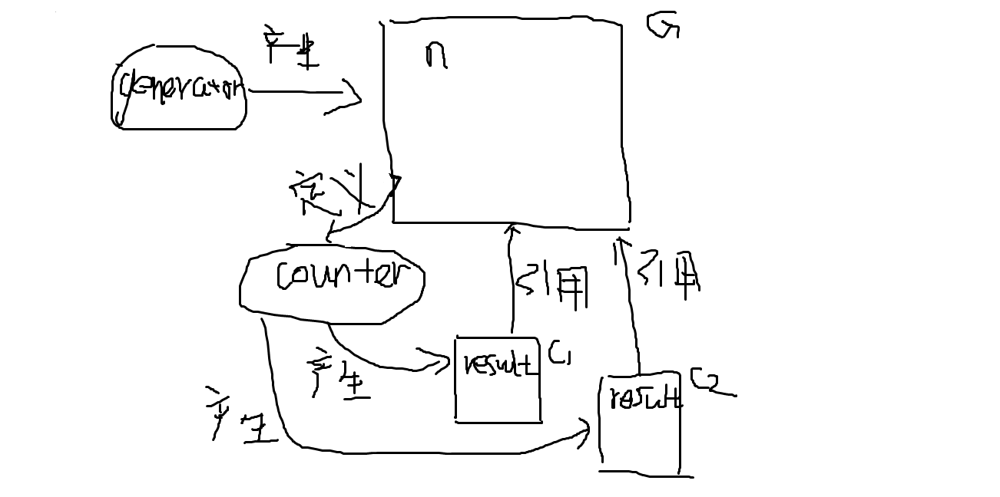

环境模型这词来自于《SICP》这本书。

> The environment is crucial to the evaluation process, because it determines the context in which an
expression should be evaluated.
Indeed, one could say that expressions in a programming language do not,in themselves, have any meaning. Rather, an expression acquires a meaning only with respect to some environment in which it is evaluated. Even the interpretation of an expression as straightforward as (+ 1 1) depends on an understanding that one is operating in a context in which + is the symbol for addition.

> 环境对于求值过程是至关重要的，因为它确定了表达式求值的上下文。
实际上，我们可以认为表达式本身在一个程序语言里没有任何意义。一个表达式的意义取决于他求值时所在的环境。甚至像(+ 1 1)这样一个极其简单的表达式的解释过程，都需要在一个符号+表示加法的上下文里执行。

ES的环境，可以看作是变量约束存在的上下文，变量的值取决于他所在的环境。

# 环境的访问

* 使用**var**关键字就能将变量约束加入当前环境。
* 使用一个变量时，如果当前环境不存在他的约束，会尝试从外层的环境中访问。

~~~
var x = 2017;
var foo = function () {
    x = x + 1;
}
foo();
console.dir(x);//2018
~~~

以上代码执行时存在两个环境。

环境一是定义foo函数时所在的环境，该环境存在两个变量约束，变量x，变量foo。
环境二是执行foo函数时产生的环境，不存在变量约束。

因此，在环境二中访问变量x时，环境二不存在变量x的约束。接着，变量x就会引用外层环境中的约束(x,2017)，在函数中进行x=x+1修改x的值。最后，在环境一中，用console.dir(x)打印x的值2018。

# 环境的生成

环境是由函数生成的。

* 一个函数在定义时，会保存所在环境的引用。
* 一个函数在执行时，会产生一个新的环境。该环境除了包含变量的约束外，还存在一个指向函数定义时所在环境的引用。

举个例子：

~~~
var generator = function () {
    var n = 0;
    return function () {
        var result = n;
        n = n + 1;
        return result;
    };
};

var counter = generator();

console.dir(counter());//0
console.dir(counter());//1
console.dir(counter());//2
~~~

generator函数在执行时，产生了一个新环境G。环境G存在变量n的约束，并且定义和返回了一个函数，该函数保存了环境G的引用。

counter变量得到generator返回的函数对象，我们可以将counter视为一个函数。

每次执行counter函数，都产生一个新环境Cx，环境Cx存在一个指向环境G的引用。在环境Cx使用变量n时，由于环境Cx不存在变量n的约束，程序就会尝试从环境Cx引用的环境G中寻找。
因此，每次执行counter函数都使得环境G的n+1，得到上面的结果。

这也是所谓的闭包。（闭包指的是他实现用的技术，而不是他的行为。）

> 一个操作组合而来的结果能通过同样的操作进行组合，就是说明该操作满足闭包性质。

# 环境的回收

环境里包含着变量的约束，变量的约束是会占据计算机的资源的，于是就需要回收环境释放变量约束占据的资源。

如果一个环境，不能再被ES程序访问，回收他就不会有任何副作用了。

那么如何判断一个环境不会再被访问呢？
其实一旦环境的引用，也就是直接或间接保存着环境引用的函数，不再存在于其他仍然能被访问的环境中，就可以断定那个环境再也不会被访问。ES程序将会自动对其进行回收。

同理，如果一个对象不存在活跃环境的约束之中，就会被ES自动回收。

这就是所谓的GC。（garbage collection 垃圾回收）

~~~
var funcA = function () {
    var obj = {};
};
funcA();//环境不存在引用，本次funcA执行时产生的环境将被自动回收。

var funcB = function () {
    var obj = {}
    return function () { };
};

var foo = funcB();//环境存在引用，本次funcB执行时产生的环境将被保留。

//...
foo = null;//foo约束的函数失去引用，该函数所保留的环境引用不存在于外部环境，之前funcB产生的环境将被自动回收。
~~~

