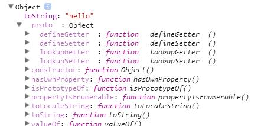

对象的属性可以通过两种方式访问:
* obj.key1。key1为字符串。
* obj\[key2\]。key2为任意值。

~~~
var obj = {};
obj.foo = 10;
obj['foo'] = 20;
console.log(obj.foo);//20
~~~

使用obj.key语法去访问一个属性时，key部分会有跟变量名一样的命名限制。
使用obj\[key\]则没有，甚至能通过变量传入键名。如:

~~~
var obj = {};
obj.*foo=10;//报错
var key = '***';
obj[key] = 666;//obj['***']为666
~~~

理论上，对象访问不同键名的属性都一样快，也不会因为属性数量的增长而变慢。详情自寻哈希表。

# \_\_proto\_\_

当访问对象一个不存在的属性时，会试图从他的\_\_proto\_\_属性引用的原型中访问该属性。
而一个原型对象也有他的\_\_proto\_\_属性，所以会一直往下寻找，直到找到那个属性或原型不存在(null)时。
这就是所谓的原型链。关于如何生成原型链，将会在后文进行讲解。

~~~
var foo={};//foo没有设定任何属性。
foo.toString()//从原型中访问。
~~~

如果给对象不存在的属性进行赋值，就会为该对象生成新的属性，但不会进入该对象的原型进行寻找和访问。

~~~
var foo = {};
foo.toString = "hello";
console.dir(foo);
~~~

