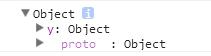

对象的属性可以通过两种方式进行访问:

* obj.key1。key1为标识符。
* obj\[key2\]。key2为任意值。

~~~
var obj = {};
obj.foo = 10;
obj['foo'] = 20;
console.log(obj.foo);//20
~~~

使用obj.key语法去访问一个属性时，key部分会有跟变量名一样的命名限制。
使用obj\[key\]则没有，甚至能通过变量传入键名。如:

~~~
var obj = {};
obj.*foo=10;//报错
var key = '***';
obj[key] = 666;//obj['***']为666
~~~

理论上，对象访问不同键名的属性都一样快，也不会因为属性数量的增长而变慢。详情自寻哈希表。

# delete

对一个对象不存的属性进行赋值，会为该对象添加属性。
对一个对象的属性使用delete关键字，则会从对象中删除该属性。

~~~
var foo = {};
foo.x = {};
foo.y = foo.x;
delete foo.x;
console.dir(foo);
~~~

