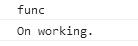
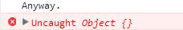

异常跟顺序，选择，循环，函数调用一样，属于控制流程之一。

异常控制与函数的行为有关。

# 调用栈

我们可以把函数的调用和完成行为，看作是对一个叫调用栈的顺序容器的操作。

* 每一次函数被调用时，该函数的运行副本都会被加入到调用栈的顶部。
* 而调用栈顶部的函数总是执行中的函数。
* 每一次函数执行完毕后，就会从调用栈顶部移除。（此时位于调用栈顶部的函数就会被继续执行）

~~~
var funcA = function () { };
var funcB = function () {
    funcA();
    //...
};

funcB();
~~~

以上代码的控制流程是：

1. 调用funcB，调用栈加入funcB。（调用栈：funcB）
2. 执行funcB。（调用栈：funcB）
3. 调用funcA，调用栈加入funcA。（调用栈：funcB funcA）
4. 执行funcA。（调用栈：funcB funcA）
5. funcA执行完毕，调用栈顶部的函数被移除。(调用栈：funcB)
6. 继续执行funcB。(调用栈：funcB)
7. funcB执行完毕，调用栈顶部的函数被移除。(调用栈：)

# 异常控制

* 如果一个函数在执行中抛出了异常，函数就会被强制结束，调用栈顶部的函数也会因此被移除。并且，该异常仍会从栈顶函数继续执行的位置处抛出。
* 如果一个异常被捕捉，调用栈中的函数会在异常处理后继续工作。

在ES中，使用关键字**throw**主动抛出一个异常，使用关键字**try**捕捉一个语句块里的异常，使用关键字**catch**处理捕捉到的异常。

~~~
var func = function () {
    throw "func";
}

try {
    func();
}
catch (e) {
    console.log(e);
}

console.log('On working.');
~~~

ES还提供了一个处理异常的关键字**finally**，在finally语句块中的代码，无论异常发生与否都会被执行。
甚至从catch中抛出了异常，finally仍然会被处理。

~~~
try {
    throw {};
}
catch (e) {
    throw e;//相当于在函数中继续抛出异常。
}
finally {
    console.log("Anyway.");
}

console.log("On working.");//no~
~~~

