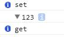

ES5扩展了Object对象的接口，增加了几个特别的函数，可以在程序运行时影响解释器的行为。如：defineProperty，seal，freeze...等等。

实际上这些函数改变的是对象的内部状态，解释器在解释对象时会根据他的内部状态改变自己的行为，这些状态被称为特性（attribute）。

ES5能直接操作对象的属性描述，一个普通属性拥有四种特性。

* value。访问属性时的值。
* writable。表示属性value的可写性。
* enumerable。表示属性可枚举。
* configurable。表示属性描述可配置。

使用getOwnPropertyDescriptor函数可以获取属性的描述。

~~~
var foo = { a: 0 };
var desc = Object.getOwnPropertyDescriptor(foo, 'a');
console.dir(desc);
~~~

可见除了value被设置了，其他特性默认值为true。
通过defineProperty或defineProperties可以定义或修改属性的描述。如

~~~
var foo = {};
Object.defineProperties(foo, {
    a: {
        value: 0,
        writable: false,
    }
});

console.dir(foo);//{a:0}
foo.a = 666;
console.dir(foo);//{a:0}
~~~

可见，当writable为false时，该属性就不可写。
ES5内置的其他特性也会影响解释器的行为，具体此处不再详述。

# 访问器属性

在ES5还提供了一种叫访问器的属性，而之前ES默认使用的属性被称为数据属性。
访问器属性的描述有四种特性。

* get。获取属性值时触发的函数。
* set。设置属性值时触发的函数。
* enumerable。表示属性可枚举。
* configurable。表示属性的可配置。

事实上，我们可以把访问器属性看作是特殊的函数，不过一个属性有可能被分为两个函数。

~~~
var foo = {};
Object.defineProperties(foo, {
    a: {
        set: function (v) {
            console.info('set');
            console.dir(v);
        },
        get: function () {
            return 'get';
        }
    }
});

foo.a = 123;
console.info(foo.a);
~~~

# 以属性描述为起点

在一些高级语言里，也有特性的概念。如C#的特性，JAVA的注解，他们也能在运行时影响解释器的行为。而C#/JAVA中的特性更为强大，不仅能描述属性，还能描述类，描述函数……等等，又或是添加自定义的特性，在运行中反射特性为自己所用，却可以不改变已有代码的结构。这也是所谓的AOP（面向切面编程）。

目前来说，ES的特性（attribute）只有一些简单的功能，但可以想象的是，ES未来发展一定会逐步完善特性。

